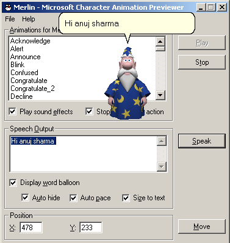



## Office Assistant like Ms word/Outlook

### Description

When u open outlook/ms-word a office assistance comes up,this application just works as outlook or word. u can this assistance in any u r application. its works very nice. this application is good & i take this application thought from a web-site. but now its yours. OFFICE ASSISTANCE.
 
### More Info
 

             |
---                |---
**Submitted On**   |1998-09-30 09:04:30
**By**             |[Anuj sharrma](https://github.com/Planet-Source-Code/PSCIndex/blob/master/ByAuthor/anuj-sharrma.md)
**Level**          |Beginner
**User Rating**    |4.6 (41 globes from 9 users)
**Compatibility**  |VB 6\.0
**Category**       |[Graphics](https://github.com/Planet-Source-Code/PSCIndex/blob/master/ByCategory/graphics__1-46.md)
**World**          |[Visual Basic](https://github.com/Planet-Source-Code/PSCIndex/blob/master/ByWorld/visual-basic.md)
**Archive File**   |[Office\_Ass18190811172004\.zip](https://github.com/Planet-Source-Code/anuj-sharrma-office-assistant-like-ms-word-outlook__1-57292/archive/master.zip)

